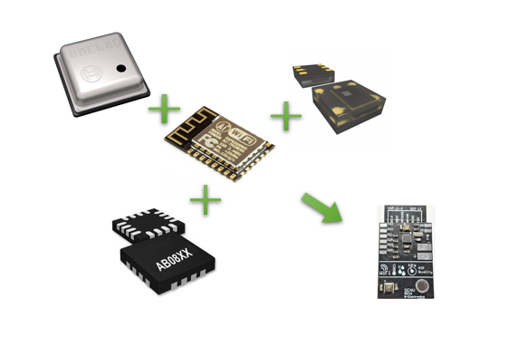
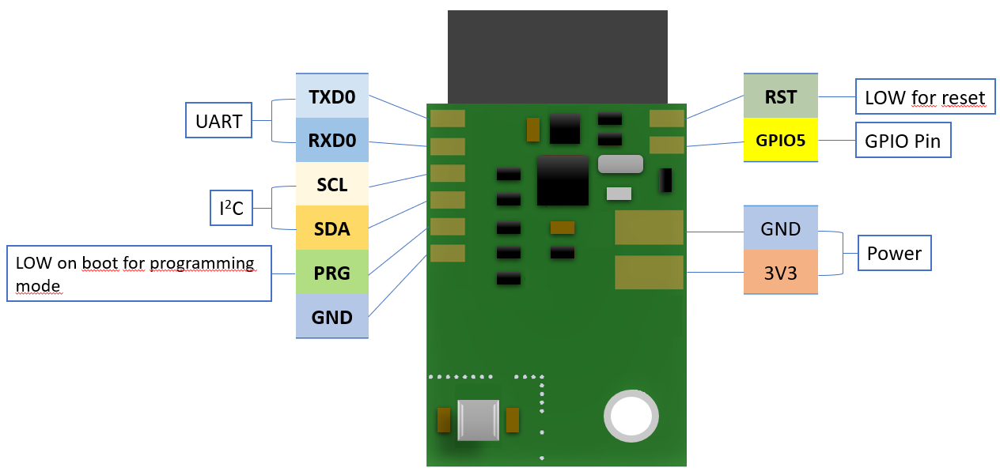

# EnvSens

EnvSens is a compact sensor module for ambient air and brightness monitoring with an ESP-12E Wifi microcontroller.
It runs until a minimal battery voltage from 2.5 V properly. Ideal for IoT applications!

With help of the BME680 sensor from Bosch, temperature, humidity, air pressure and air quality can be measured in a very energy-saving way.
In addition, LITE-ON's LTR303 digital ambient light sensor enables the monitoring of daylight and lamp light close to the spectral viewing range.
A real-time clock (RTC) AB0805 from Abracon provides the time for the measuring points with low power consumption.
All modules are connected to ESP-12E via I2C bus.

---

## Hardware

| Module | Function | Datasheet | Software Library |
| - | - | - | - |
| Bosch BME680 | Temperature, Humidity, Pressure, Air Quality | [bst-bme680-ds001.pdf](https://www.bosch-sensortec.com/media/boschsensortec/downloads/datasheets/bst-bme680-ds001.pdf) | [Adafruit_BME680](https://github.com/adafruit/Adafruit_BME680) |
| LITE-ON LTR303 | Ambient Light Sensor | [Lite-On_LTR-303ALS-01_DS.pdf](https://www.mouser.com/datasheet/2/239/Lite-On_LTR-303ALS-01_DS_ver%201.1-1175269.pdf)| [Automote_LTR303](https://github.com/automote/LTR303) |
| Abracon AB0805 | RTC | [AB08X5-RTC.PDF](https://abracon.com/Precisiontiming/AB08X5-RTC.PDF ) | [AB0805_lib (*)](https://github.com/curransinha/AB0805_lib) |
| AI-Thinker ESP-12E | 32 Bit Microcontroller with WiFi | [ESP12E_Datasheet.pdf](https://components101.com/sites/default/files/component_datasheet/ESP12E%20Datasheet.pdf) |
| * Issue in Abracon AB0805 Library: Hours shows 0 every time. Resolution -> Remove all functions for 12-hour format (see issues discussions) |

---

## Pinout

